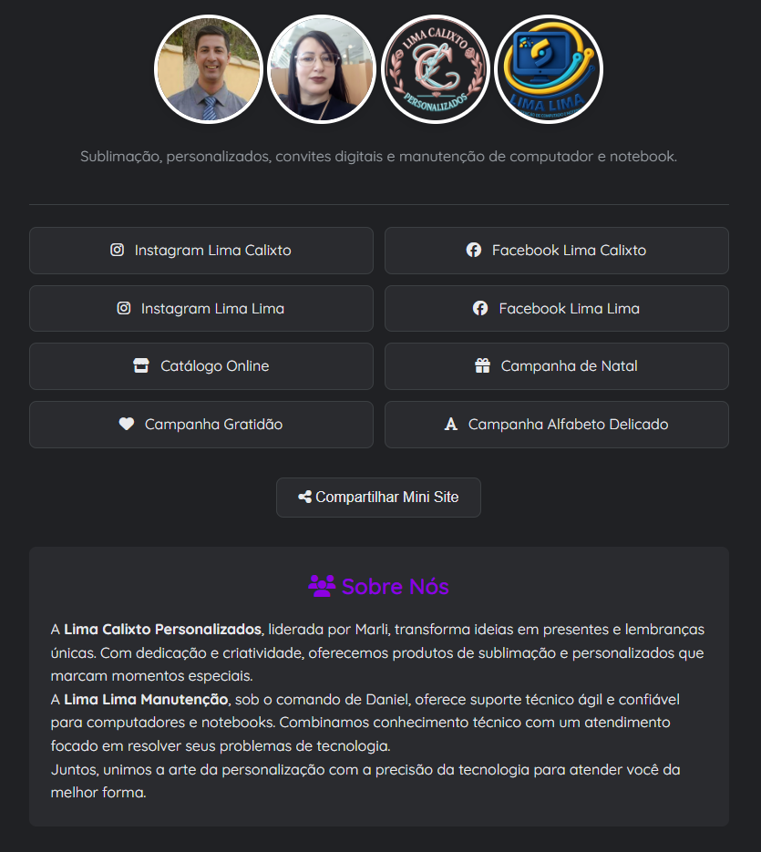

# Mini Site de Portfólio - Lima Calixto & Lima Lima

 <!-- Sugestão: Tire um print da tela principal e substitua o link -->

## 📝 Descrição

Este é um mini site responsivo, no estilo "link na bio", projetado para apresentar os serviços e produtos de duas marcas: **Lima Calixto Personalizados** e **Lima Lima Manutenção**. O site centraliza links de redes sociais, catálogos e contatos diretos, além de exibir um mini catálogo de produtos.

O projeto foi construído com HTML, CSS e JavaScript puros, sem a necessidade de frameworks, e inclui funcionalidades modernas para melhorar a experiência do usuário.

### ✨ Funcionalidades Principais

- **Design Responsivo**: Totalmente adaptável a desktops, tablets e celulares.
- **Alternador de Tema**: Permite ao usuário escolher entre um tema claro e um escuro, com a preferência salva localmente.
- **Mini Catálogo de Produtos**: Exibe produtos com imagem, título, descrição e botões de ação.
- **Galeria Lightbox**: As imagens dos produtos podem ser ampliadas em uma galeria com navegação por botões e teclado (setas e Esc).
- **Integração com WhatsApp**: Botões para solicitar produtos ou entrar em contato que abrem o WhatsApp com mensagens personalizadas.
- **Botão "Voltar ao Topo"**: Aparece durante a rolagem para facilitar a navegação.
- **Funcionalidade de Compartilhamento**: Permite compartilhar o link do mini site facilmente no WhatsApp e Telegram.
- **Animações Suaves**: Animações de entrada e efeitos de `hover` para uma experiência mais fluida.

---

## 🚀 Instalação e Execução

Por ser um projeto estático (front-end puro), não há um processo de instalação complexo ou dependências.

### Opção 1: Abrir localmente no navegador

1.  Faça o clone ou o download deste repositório:
    ```sh
    git clone https://github.com/seu-usuario/seu-repositorio.git
    ```
2.  Navegue até a pasta do projeto.
3.  Abra o arquivo `index.html` diretamente no seu navegador de preferência (Google Chrome, Firefox, etc.).

### Opção 2: Usar um servidor local (Recomendado para desenvolvimento)

Para evitar possíveis problemas com políticas de CORS do navegador, é recomendado usar um servidor local.

1.  Se você tiver o **Node.js** instalado, pode usar o `live-server`:
    ```sh
    # Instale o live-server globalmente (apenas uma vez)
    npm install -g live-server

    # Na pasta do projeto, execute:
    live-server
    ```
2.  Se você tiver o **Python** instalado, pode usar o módulo `http.server`:
    ```sh
    # Na pasta do projeto, execute (para Python 3):
    python -m http.server
    ```

---

## 🛠️ Uso e Customização

A maior parte do conteúdo do site pode ser editada diretamente no arquivo `index.html`.

- **Adicionar/Editar Produtos**:
  - Vá até a seção `<section class="catalog">`.
  - Copie e cole um bloco `<div class="product-card">...</div>`.
  - Altere a imagem (`src` e `href`), o título (`<h3>`), a descrição (`<p>`) e os atributos `data-phone` e `data-msg` no botão do WhatsApp.

- **Alterar Contatos de WhatsApp**:
  - **Nos produtos**: Modifique o atributo `data-phone` nos botões `<button class="card-wp">`.
  - **No rodapé**: Modifique o atributo `data-phone` nos links `<a>` com os IDs `footerWaMarli` e `footerWaDaniel`. As mensagens personalizadas para estes botões estão no arquivo `script.js`.

- **Alterar Links de Redes Sociais**:
  - Modifique os links (`href`) na seção `<div class="social-grid">`.

---

## 📄 Licença

Este projeto está sob a licença MIT. Veja o arquivo `LICENSE` para mais detalhes.

---

Feito com ❤️ por [Seu Nome/Sua Empresa].